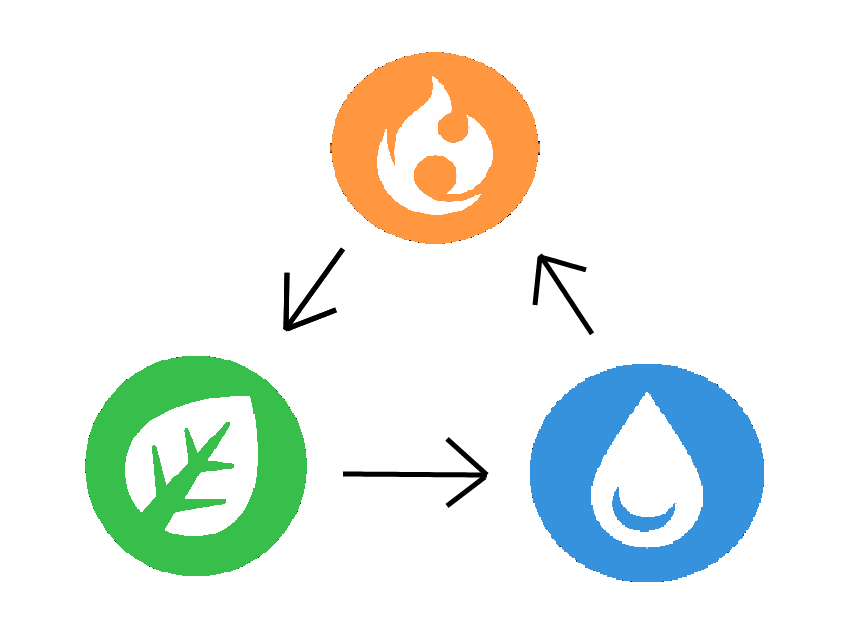

<h1 align="center">  Jokenpô de Pokemon - Java Socket
    
  
    
</h1>

 🎲 - Projeto de desenvolvimento de um jogo estilo Jokenpô de Pokemon utilizando Java Socket. Basicamente o jogador poderá testar a sua sorte ao escolher um dentre os 3 elementos: Fire, Grass ou Water! 

Alunos: 
Natan Santos Bastos - 125111373706  
Pedro Henrique Gil Antunes - 125111378102  
Pedro Henrique Silva Torres Souza - 125111357179  
   

<h1 align="center">Universidade Anhembi Morumbi
    

<h1 align="center"> Lógica do Jogo </h1>
    

 🎮 - Ao escolher o elemento do seu Pokemon inicial o jogador saberá se venceu ou se perdeu a batalha:
     
 
 
 
 0: Fire
 
<h1 align="center">

 
</h1>
 
 1: Grass
 
 <h1 align="center">

 
</h1>

 2: Water
 
<h1 align="center">

 
</h1>

